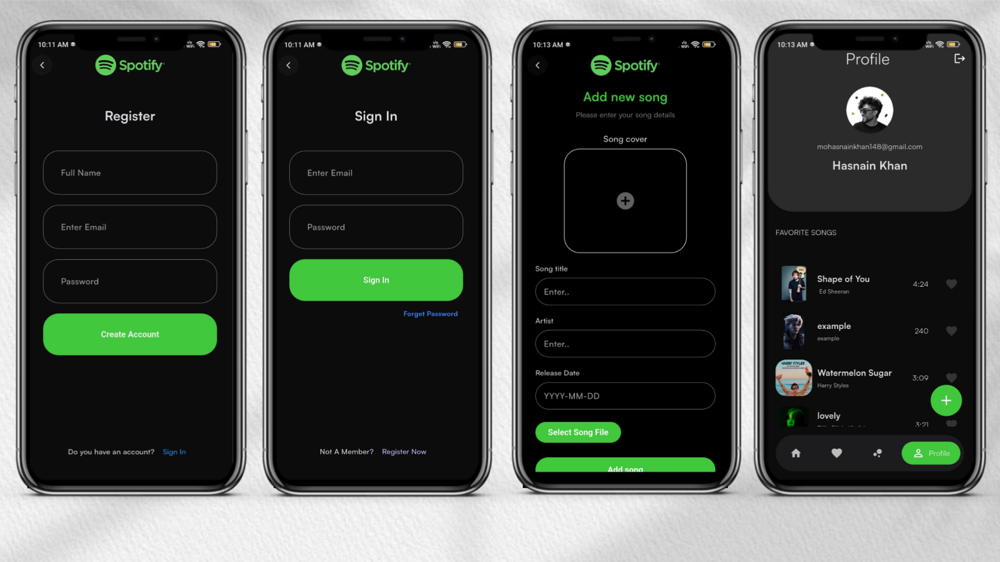
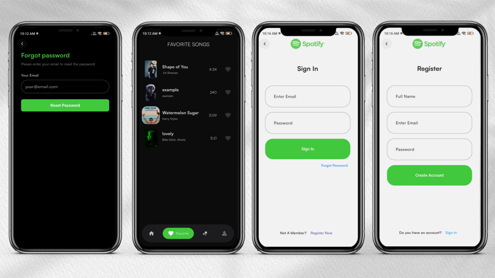

🎧 AuraStream: Flutter Music App with Gemini AI

A clean, modern Flutter music app using **Firebase**, **BLoC**, **Hive**, **get_it**, **Cloudinary**, and **Gemini API** — built with **Clean Architecture** and **SOLID** principles.

---

## 🚀 Features

* 🔐 User Authentication (Sign Up / Sign In / Forgot Password)
* 📝 Add & Upload Songs (title, artist, genre)
* 🖼️ Cloudinary Image & Song Uploads
* 🌐 Firebase Backend (Auth + Firestore + Storage)
* 🧠 State Management with BLoC / Cubit
* 💾 Offline Caching via Hive
* 🧰 Dependency Injection using get_it
* 🧱 Clean Architecture (Presentation / Domain / Data)
* 🔁 REST API via `http`
* 🌗 Light / Dark Theme Support
* 🤖 **AI Assistant (Gemini API Integration)** — *Smart recommendations, chat, and lyrics help*

---


## 🖼️ Screenshots

|   Ui |   Ui |   Ui |   Ui |
|:--------:|:----------:|:----------:|:----------:|
|  |  |  |   |

## 📁 Structure

```
lib/
├─ core/
├─ data/ (models, repositories, sources)
├─ domain/ (entities, usecases)
├─ presentation/ (blocs, pages, widgets)
├─ di/ (service_locator.dart)
└─ main.dart
```

---

## ⚙️ Setup

1. **Clone the repo**

```bash
git clone https://github.com/<your-username>/<repo>.git
```

2. **Create `.env`**

```
FIREBASE_API_KEY=...
CLOUDINARY_CLOUD_NAME=...
GEMINI_API_KEY=...
```

3. **Install & Run**

```bash
flutter pub get
flutter run
```

---

## 🧠 Highlights

* BLoC handles UI logic cleanly.
* Hive stores user data & songs locally.
* Cloudinary stores song covers & files.
* **Gemini AI Assistant** integrates via REST for:

  * 🎵 Song recommendations
  * ✍️ Lyrics generation or completion
  * 💬 Conversational search
* get_it manages dependencies across layers.

---

## 🧱 Example Dependency Setup

```dart
final sl = GetIt.instance;

Future<void> init() async {
  sl.registerLazySingleton(() => FirebaseAuth.instance);
  sl.registerLazySingleton<AuthRepository>(() => AuthRepositoryImpl(sl()));
  sl.registerFactory(() => AuthBloc(signInUsecase: sl()));
}
```

---

## 🧼 Notes

* Store keys securely (never commit `.env`).
* Validate uploads before sending.
* Follow Clean Architecture + SOLID.

---

## 🧩 Commands

* Run: `flutter run`
* Build: `flutter build apk --release`
* Analyze: `flutter analyze`

---

### 🤝 Contribute

PRs welcome! Keep code clean, tested, and structured.

---

### 📜 License

Choose MIT / Apache / GPL as needed.
